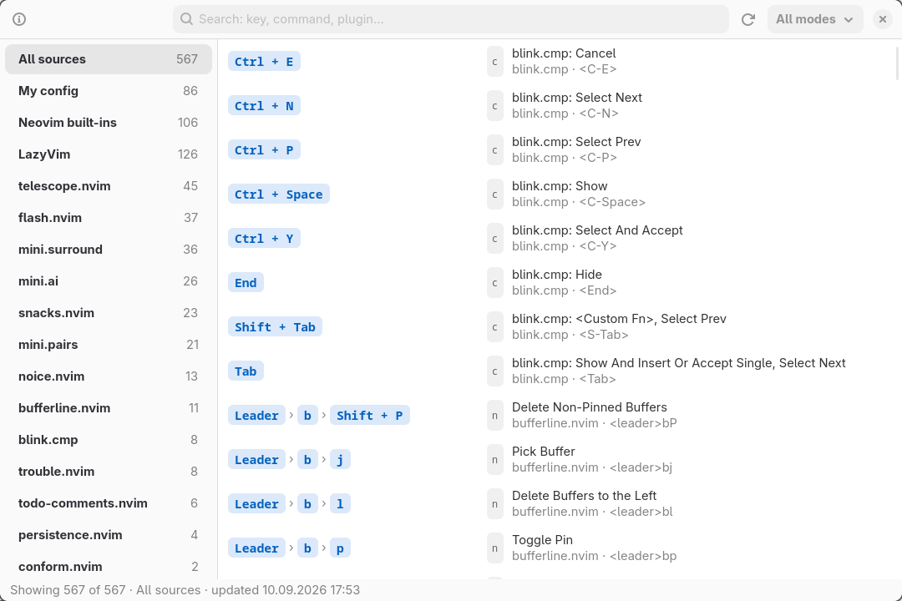

# nvim-keys

A searchable cheatsheet for every keymap in your Neovim setup — grouped by the
plugin that defines it, rendered as real key presses instead of raw vim
notation, one click away from your status bar.

[Русская версия](README.ru.md)



## Why

`:map` dumps hundreds of lines and never says which plugin owns what.
`which-key` only helps once you already know the prefix. `nvim-keys` collects
everything up front — including mappings from plugins that are still lazy-loaded
— and lets you search across keys, descriptions and plugin names.

- **Grouped by source.** Each mapping is attributed to the plugin that created
  it, to your own config, or to Neovim itself.
- **Human-readable keys.** `<C-/>` becomes `Ctrl + /`, `<leader>bj` becomes
  `Leader › b › j`; the original notation stays visible underneath.
- **Search everything.** Key, description, command, plugin, mode — all at once,
  in both notations (`ctrl+p` and `<C-P>` both match).
- **Search by pressing the chord.** `Ctrl+K` starts capture mode: press
  `Ctrl+I`, or `Space` then `s`, and the list shows what that chord does in
  Neovim.
- **Readable descriptions.** Cryptic ones (`<lua function>`, `:cpfile`,
  `<Plug>(MatchitNormalForward)`) are replaced with plain sentences.
- **Status bar module.** Waybar module with a live keymap count; click to open.
- **Recipes.** A hand-written cheatsheet next to the collected keymaps: jumping
  to a line, finding it, undoing changes, deleting and renaming files — each
  entry with a concrete example. Extend it with your own file.
- **English and Russian**, switched in the window (EN/RU) and remembered;
  descriptions coming from plugins are translated by a dictionary.

## How it works

`nvim-keys dump` starts a headless Neovim, loads your config, then:

1. **Loads every lazy.nvim plugin** (`require("lazy").load`) and fires
   `VeryLazy`/`UIEnter` manually — headless never triggers them, and
   distributions like LazyVim hang most of their keymaps off that event.
2. **Records the origin of each mapping.** A prelude loaded via `--cmd` (before
   your config) wraps `vim.keymap.set` and `nvim_set_keymap`, capturing the Lua
   call stack. This is the only reliable way to attribute mappings with a string
   `rhs`: their `sid` always points at `init.lua`, because required Lua modules
   get no script id of their own. Wrapper frames (`snacks.util.set_keymap`,
   lazy.nvim's keys handler, `vim/keymap.lua`) are skipped so the real owner
   surfaces.
3. **Reads lazy.nvim key specs** (`p._.handlers.keys`), which covers plugins that
   are not loaded yet — those rows are tagged `lazy`.
4. Writes everything to `~/.cache/nvim-keys/keymaps.json`.

The GUI only reads that JSON, so it opens instantly. The cache is rebuilt
automatically when any file in your Neovim config is newer than it.

## Requirements

- Neovim 0.9+ (developed against 0.12)
- Python 3 with PyGObject, GTK 4 and libadwaita
- `jq`
- Optional: a Nerd Font for the Waybar glyph, Waybar, Hyprland

On Arch: `pacman -S neovim python-gobject gtk4 libadwaita jq`

## Install

```sh
git clone https://github.com/OneCOlyl/nvim-keys.git
cd nvim-keys
./install.sh          # copy into ~/.local
./install.sh --link   # or symlink this checkout (for development)
nvim-keys dump
nvim-keys gui
```

Uninstall with `./install.sh --uninstall`.

## Usage

| Command | What it does |
| --- | --- |
| `nvim-keys gui` | Open the window (rebuilds the cache if stale) |
| `nvim-keys dump` | Rebuild the cache now |
| `nvim-keys waybar` | Print JSON for a Waybar custom module |
| `nvim-keys list` | Plain text listing for the terminal |
| `nvim-keys recipes` | Print the cheatsheet with examples |
| `nvim-keys json` | Print the raw cache |

In the window: type to search, `Enter` copies the key, `F1` explains the
notation, `Ctrl+K` captures a chord, `Ctrl+R` rebuilds, `Esc` closes.

### Capture mode

`Ctrl+K` (or the keyboard button in the header) turns the search field into a
chord recorder: every press is added as a key chip and the list is filtered to
the mappings that start with it. `Backspace` erases the last press, `Esc`
leaves the mode. If nothing is mapped to the chord, the list falls back to rows
that merely mention it — that is how built-ins like `<C-i>`, described in the
recipes, still answer the question.

### Descriptions

Plugins describe their mappings in English, and some do not describe them at
all. [`data/descriptions.json`](data/descriptions.json) is the layer that fixes
both:

- `noise` — descriptions that say nothing (`<lua function>`); such rows fall
  back to the command itself, then to the key.
- `rewrite` — regexes turning a cryptic description into a readable sentence in
  both languages (`:cpfile`, `:help Y-default`, matchit's `<Plug>` maps).
- `by_key` — text for a mapping nobody described, chosen by the key itself.
- `translations.ru` — `phrases` (whole description), `tails` (the trailing
  `(Root Dir)`, `(cwd)`, `(Trouble)`) and `words` as a last resort. Whatever is
  not in the dictionary stays in English.

Your own `~/.config/nvim-keys/descriptions.json` is merged on top, so you can
fix or translate a single mapping without touching the shipped file.

### Recipes

Not everything worth remembering is a keymap: `:earlier 10s`, `:g/TODO/#` or
`:call delete(expand('%')) | bdelete!` never show up in `:map`. Those live in
[`data/recipes.json`](data/recipes.json) and appear in the window as the
**Recipes** source — key or command, description, and an example underneath.
They are searched together with everything else, so typing `delete file` or
`undo` finds them.

Add your own in `~/.config/nvim-keys/recipes.json`, using the same shape; it is
merged after the shipped file:

```json
{
  "categories": [
    {
      "id": "mine",
      "title": { "en": "My recipes", "ru": "Мои приёмы" },
      "items": [
        {
          "keys": ":%s/old/new/g",
          "kind": "cmd",
          "mode": "c",
          "desc": { "en": "Replace in the whole file", "ru": "Заменить во всём файле" },
          "example": { "en": ":%s/old/new/gc — ask before each one", "ru": ":%s/old/new/gc — спрашивать про каждое" }
        }
      ]
    }
  ]
}
```

`kind` is `key` (rendered as key chips) or `cmd` (rendered as a literal
command); `needs` optionally names the plugin an entry depends on.

### Waybar

Copy the module from [`examples/waybar.jsonc`](examples/waybar.jsonc) into your
`config.jsonc`, the styling from [`examples/waybar.css`](examples/waybar.css)
into `style.css`, and add `custom/nvim-keys` to one of the `modules-*` arrays.
Left click opens the window, right click rebuilds the cache.

### Hyprland

[`examples/hyprland.conf`](examples/hyprland.conf) floats and centers the window
(`class: dev.local.nvim-keys`) and shows an optional keybinding.

## Environment variables

| Variable | Effect |
| --- | --- |
| `NVIM_KEYS_LANG` | `en` or `ru`, used until you pick a language in the window |
| `NVIM_KEYS_ICON` | Replace the Nerd Font glyph in the Waybar module |
| `NVIM_KEYS_HOME` | Where the installed Lua/GUI files live |
| `NVIM_KEYS_RECIPES` | Use this recipes file instead of the shipped one |
| `NVIM_KEYS_DESCRIPTIONS` | Use this descriptions file instead of the shipped one |
| `NVIM_APPNAME` | Respected when looking for your Neovim config |

## Notes and limits

- Buffer-local mappings that only exist while a buffer is open (LSP keymaps, for
  example) are read from LazyVim's spec when available; other distributions may
  expose fewer of them.
- Attribution is heuristic for mappings created inside deeply wrapped helpers.
  Each row's tooltip shows the exact file and line it was traced to, so
  mistakes are easy to spot.
- Anything a plugin registers only after some runtime condition (a picker being
  open, a terminal being focused) won't be visible to a headless dump.

## License

MIT — see [LICENSE](LICENSE).
